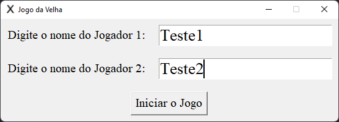
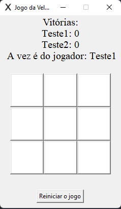

# Jogo-da-Velha-Tkinter
  Cria o jogo da velha usando o Tkinter

## Descrição
Usa a biblioteca do Tkinter para criar as janelas executando o jogo. É dividido em duas janelas, a primeira lê o nome dos dois jogadores e a segunda é o jogo. Só é possível abrir a segunda janela quando a primeira é totalmente preenchida. Quando acontece alguma vitoria ou velha é criado outra janela com a função messagebox do Tkinter

## Resultado

